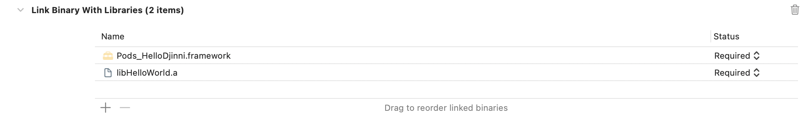
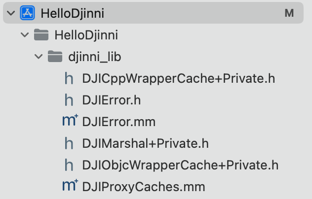
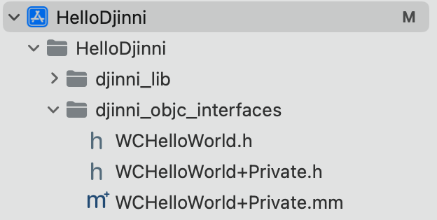

# HelloDjinni

[TOC]

## 1、介绍Djinni

Djinni目前有两个github版本

* [Dropbox版本](https://github.com/dropbox/djinni)
* [Snapchat版本](https://github.com/Snapchat/djinni)。该版本是继承自Dropbox版本，增加使用Bazel工具

由于对Bazel不了解，并简化一些依赖问题，本文采用原始版本来使用Djinni。

> 这里有个官方网站[^1]用于介绍Djinni，本文优先参考这个网站的内容。

在官方网站[^1]上，定义Djinni是一个简单IDL，如下

> The Djinni [**Interface Definition Language**](https://djinni.xlcpp.dev/djinni-generator/idl/) provides a simple, yet powerful way to design your interfaces.

可以理解为Djinni是一门IDL语言，使用配套工具生成平台(Android/iOS等)特性的接口，方便调用C++的实现。

官方文档[^1]描述，如下

> With Djinni you can implement interfaces in any target language and call the implementation from C++!


官方文档[^1]使用下面这个图，比较形象描述Djinni用于桥接C++到各个平台的语言。


### (1) djinni命令行工具

使用[Dropbox版本](https://github.com/dropbox/djinni)的git源码，在src文件下找到run文件。这个可执行文件是djinni命令行工具。

查看帮助信息，如下

```shell
$ src/run --help
Already up to date: Djinni
Usage: djinni [options]

  --help
...
```

说明

> 1. 首次执行命令会下载依赖库，编译scala源码
>
> 2. 为了方便在其他地方使用，可以设置run的别名，并将所在文件夹导入到环境变量PATH中
>
>    ```shell
>    $ cd src    
>    $ ln -s run djinni
>    ```
>
>    这里以使用zsh为例，添加下行代码
>
>    ```shell
>    export PATH="$PATH:$HOME/GitHub_Projects/HelloDjinni/djinni/src"
>    ```
>
>    在新开Terminal中，执行`djinni --help`
>
>    ```shell
>    $ djinni --help
>    Already up to date: Djinni
>    Usage: djinni [options]
>    ...
>    ```
>
> 3. run命令实际是bash脚本

执行`src/run --help`命令，输出的帮助信息，大致分为下面几个部分

* 输出java接口
* 输出C++接口
* 输出JNI接口
* 输出Objective-C接口
* 输出Objective-C++接口
* 输出yaml接口


#### a. 输出java接口

输出java接口的选项，如下

```shell
  --java-out <out-folder>
        The output for the Java files (Generator disabled if unspecified).
  --java-package ...
        The package name to use for generated Java classes.
  --java-class-access-modifier <public/package>
        The access modifier to use for generated Java classes (default: public).
  --java-cpp-exception <exception-class>
        The type for translated C++ exceptions in Java (default: java.lang.RuntimeException that is not checked)
  --java-annotation <annotation-class>
        Java annotation (@Foo) to place on all generated Java classes
  --java-generate-interfaces <true/false>
        Whether Java interfaces should be used instead of abstract classes where possible (default: false).
  --java-nullable-annotation <nullable-annotation-class>
        Java annotation (@Nullable) to place on all fields and return values that are optional
  --java-nonnull-annotation <nonnull-annotation-class>
        Java annotation (@Nonnull) to place on all fields and return values that are not optional
  --java-implement-android-os-parcelable <true/false>
        all generated java classes will implement the interface android.os.Parcelable
  --java-use-final-for-record <use-final-for-record>
        Whether generated Java classes for records should be marked 'final' (default: true). 
```


#### b. 输出C++接口

输出C++接口的选项，如下

```shell
  --cpp-out <out-folder>
        The output folder for C++ files (Generator disabled if unspecified).
  --cpp-header-out <out-folder>
        The output folder for C++ header files (default: the same as --cpp-out).
  --cpp-include-prefix <prefix>
        The prefix for #includes of header files from C++ files.
  --cpp-namespace ...
        The namespace name to use for generated C++ classes.
  --cpp-ext <ext>
        The filename extension for C++ files (default: "cpp").
  --hpp-ext <ext>
        The filename extension for C++ header files (default: "hpp").
  --cpp-optional-template <template>
        The template to use for optional values (default: "std::optional")
  --cpp-optional-header <header>
        The header to use for optional values (default: "<optional>")
  --cpp-enum-hash-workaround <true/false>
        Work around LWG-2148 by generating std::hash specializations for C++ enums (default: true)
  --cpp-nn-header <header>
        The header to use for non-nullable pointers
  --cpp-nn-type <header>
        The type to use for non-nullable pointers (as a substitute for std::shared_ptr)
  --cpp-nn-check-expression <header>
        The expression to use for building non-nullable pointers
  --cpp-use-wide-strings <true/false>
        Use wide strings in C++ code (default: false)
```


#### c. 输出JNI接口

输出JNI接口的选项，如下

```shell
  --jni-out <out-folder>
        The folder for the JNI C++ output files (Generator disabled if unspecified).
  --jni-header-out <out-folder>
        The folder for the JNI C++ header files (default: the same as --jni-out).
  --jni-include-prefix <prefix>
        The prefix for #includes of JNI header files from JNI C++ files.
  --jni-include-cpp-prefix <prefix>
        The prefix for #includes of the main header files from JNI C++ files.
  --jni-namespace ...
        The namespace name to use for generated JNI C++ classes.
  --jni-base-lib-include-prefix ...
        The JNI base library's include path, relative to the JNI C++ classes.
```


#### d. 输出Objective-C接口

输出Objective-C接口的选项，如下

```shell
  --objc-out <out-folder>
        The output folder for Objective-C files (Generator disabled if unspecified).
  --objc-h-ext <ext>
        The filename extension for Objective-C[++] header files (default: "h")
  --objc-type-prefix <pre>
        The prefix for Objective-C data types (usually two or three letters)
  --objc-include-prefix <prefix>
        The prefix for #import of header files from Objective-C files.
  --objc-swift-bridging-header <name>
        The name of Objective-C Bridging Header used in XCode's Swift projects.
  --objc-closed-enums <true/false>
        All generated Objective-C enums will be NS_CLOSED_ENUM (default: false). 
```


#### e. 输出Objective-C++接口

输出Objective-C++接口的选项，如下

```shell
 --objcpp-out <out-folder>
        The output folder for private Objective-C++ files (Generator disabled if unspecified).
  --objcpp-ext <ext>
        The filename extension for Objective-C++ files (default: "mm")
  --objcpp-include-prefix <prefix>
        The prefix for #import of Objective-C++ header files from Objective-C++ files.
  --objcpp-include-cpp-prefix <prefix>
        The prefix for #include of the main C++ header files from Objective-C++ files.
  --objcpp-include-objc-prefix <prefix>
        The prefix for #import of the Objective-C header files from Objective-C++ files (default: the same as --objcpp-include-prefix)
  --cpp-extended-record-include-prefix <prefix>
        The prefix path for #include of the extended record C++ header (.hpp) files
  --objc-extended-record-include-prefix <prefix>
        The prefix path for #import of the extended record Objective-C header (.h) files
  --objcpp-namespace <prefix>
        The namespace name to use for generated Objective-C++ classes.
  --objc-base-lib-include-prefix ...
        The Objective-C++ base library's include path, relative to the Objective-C++ classes.
```


#### f. 输出yaml接口

输出yaml接口的选项，如下

```shell
  --yaml-out <out-folder>
        The output folder for YAML files (Generator disabled if unspecified).
  --yaml-out-file <out-file>
        If specified all types are merged into a single YAML file instead of generating one file per type (relative to --yaml-out).
  --yaml-prefix <pre>
        The prefix to add to type names stored in YAML files (default: "").
```


## 2、使用djinni的HelloWorld示例

创建一个支持多平台的C++工程，实际包含两个部分

* C++库的提供者，包括接口文件以及C++产物
* C++库的使用者，即各个平台（Android/iOS等）的工程

说明

> 如果C++库的使用者的代码，不在这个C++工程中，C++工程也应该包括各个平台的测试工程

这里以HelloWorld示例，介绍一个完整的跨平台工程的搭建过程。


### (1) 生成接口文件

生成接口文件的步骤，参考这篇文章的步骤[^2]

* 准备好接口生成工具和编译工具
* 创建工程结构
* 创建djinni文件
* 创建shell文件
* 执行shell文件，生成接口文件


#### a. 准备好接口生成工具和编译工具

接口生成工具，即djinni命令行工具，在上面已经在环境变量PATH中配置好djinni命令。

这里的编译工具采用GN，同样gn命令也在shell中已配置好。

```shell
$ which djinni
~/GitHub_Projects/HelloDjinni/djinni/src/djinni
$ which gn
~/GitHub_Projects/HelloGN/gn/out/gn
```


#### b. 创建工程结构

HelloWorld工程，包含两部分内容

* 生成HelloWorld库，包含头文件等
* 使用HelloWorld库的各个平台的工程

目前列出生成HelloWorld库所需要的目录结构，如下

```shell
$ tree .
.
├── generated
├── idl
│   └── HelloWorld.djinni
├── run_djinni.sh
└── src
    └── hello_world_impl.cpp
```

* generated是接口文件生成的地方
* idl是放djinni文件的地方
* run_djinni.sh是运行djinni命令的脚本
* src是放C++代码的地方


#### c. 创建djinni文件

以`HelloWorld.djinni`文件为例，如下

```c++
HelloWorld = interface +c {
    static create(): HelloWorld;
    fromCpp(): string;
}
```

> 示例代码，来自https://djinni.xlcpp.dev/overview/


#### d. 创建shell文件

由于run命令的参数很多，需要配置各个平台的对应参数，一般会写driver脚本(驱动脚本)。

举个例子，如下

```bash
#! /usr/bin/env bash

# base config
base_dir=$(cd $(dirname 0) && pwd)

# idl config
# CONFIG start---
idl_folder="idl"
idl_file="HelloWorld.djinni"
# CONFIG end---
djinni_file="$base_dir/$idl_folder/$idl_file"

# cpp config
cpp_out="$base_dir/generated/cpp"
namespace="HelloDjinni"

# java config
jni_out="$base_dir/generated/jni"
java_out="$base_dir/generated/java/com/mycompany/hellodjinni"
java_package="com.mycompany.hellodjinni"

# oc config
objc_out="$base_dir/generated/objc"
objc_prefix="WC"

djinni \
   --java-out $java_out \
   --java-package $java_package \
   --ident-java-field mFooBar \
   \
   --cpp-out $cpp_out \
   --cpp-namespace $namespace \
   \
   --jni-out $jni_out \
   --ident-jni-class NativeFooBar \
   --ident-jni-file NativeFooBar \
   \
   --objc-out $objc_out \
   --objc-type-prefix $objc_prefix \
   \
   --objcpp-out $objc_out \
   \
   --idl $djinni_file

```

上面生成cpp、java、jni和oc的接口文件。


#### e. 执行shell文件，生成接口文件

```shell
$ ./run_djinni.sh
Already up to date: Djinni
Parsing...
Resolving...
Generating...
```

如果djinni执行成功，应该是上面的输出提示。


### (2) 编译C++并生成产物

#### a. 实现C++代码

在src文件夹下，创建hello_world_impl.cpp，内容如下

```c++
#include "../generated/cpp/HelloWorld.hpp"

using namespace HelloDjinni;

class HelloWorldImpl : public HelloWorld {
public:
    static std::shared_ptr<HelloWorld> create();
    std::string helloFromCpp();
};

std::shared_ptr<HelloWorld> HelloWorldImpl::create() {
    return std::make_shared<HelloWorldImpl>();
}

std::string HelloWorldImpl::helloFromCpp() {
    return "Hello From C++!";
}
```

HelloWorldImpl类是实现Djinni生成的cpp接口，这个接口文件位于generated/cpp文件夹下，内容如下

```c++
// AUTOGENERATED FILE - DO NOT MODIFY!
// This file generated by Djinni from HelloWorld.djinni

#pragma once

#include <memory>
#include <string>

namespace HelloDjinni {

class HelloWorld {
public:
    virtual ~HelloWorld() {}

    static std::shared_ptr<HelloWorld> create();

    virtual std::string helloFromCpp() = 0;
};

}  // namespace HelloDjinni
```


#### b. 使用GN编译C++代码

这里使用GN，将src中的源码编译成静态库。实际还有其他C++编译工具。

添加GN的配置文件，工程结构，如下

```shell
$ tree .
.
├── BUILD.gn
├── build
│   ├── BUILD.gn
│   ├── BUILDCONFIG.gn
│   └── toolchain
│       └── BUILD.gn
├── generated
│   ├── cpp
│   │   └── HelloWorld.hpp
│   ├── java
│   │   └── com
│   │       └── mycompany
│   │           └── hellodjinni
│   │               └── HelloWorld.java
│   ├── jni
│   │   ├── NativeHelloWorld.cpp
│   │   └── NativeHelloWorld.hpp
│   └── objc
│       ├── WCHelloWorld+Private.h
│       ├── WCHelloWorld+Private.mm
│       └── WCHelloWorld.h
├── idl
│   └── HelloWorld.djinni
├── run_djinni.sh
└── src
    └── hello_world_impl.cpp
```

运行下面命令

```shell
$ gn gen out
$ ninja -C out
ninja: Entering directory `out'
[2/2] AR libhello_static_cpp.a
```

会在out/obj下面，生成产物libHelloWorld.a。这个静态库是要提供iOS/Android等工程使用的。

说明

> GN配置文件，这里不展开介绍。参考HelloGN的README.md


由于移动平台(Android/iOS)，存在模拟器和真机调试两种，因此使用GN编译需要多种CPU架构的二进制文件。

这里以iOS为例，编译支持x64和arm64的静态库。

```shell
libName="libHelloWorld.a"

if [[ $1 = "device" ]]; then
  gn gen ios_out/arm64 --args='is_debug=true target_os="ios" target_cpu="arm64" ios_enable_code_signing=false'
  ninja -C ios_out/arm64
elif [[ $1 = "simulator" ]]; then
  gn gen ios_out/x64 --args='is_debug=true target_os="ios" target_cpu="x64" ios_enable_code_signing=false'
  ninja -C ios_out/x64
elif [[ $1 = "all" ]]; then
  gn gen ios_out/arm64 --args='is_debug=true target_os="ios" target_cpu="arm64" ios_enable_code_signing=false'
  ninja -C ios_out/arm64

  gn gen ios_out/x64 --args='is_debug=true target_os="ios" target_cpu="x64" ios_enable_code_signing=false'
  ninja -C ios_out/x64

  mkdir -p ./ios_out/all/obj
  lipo -create ./ios_out/arm64/obj/${libName} ./ios_out/x64/obj/${libName} -o ./ios_out/all/obj/${libName}
  echo "create static library ($1) successfully!"
else
  echo "Must support a parameter"
fi
```

> 示例代码，见build_ios.sh

上面执行`./build_ios.sh all`，通过lipo工具得到两种CPU架构的静态库libHelloWorld.a，这个库将在“iOS适配C++库”中使用。


### (3) iOS适配C++库

#### a. 创建iOS工程

在工程根目录创建ios_project，用于存放iOS工程相关文件。使用CocoaPod后，ios_project工程结构，如下

```shell
$ tree ios_project
ios_project
├── HelloDjinni
├── HelloDjinni.xcodeproj
├── HelloDjinni.xcworkspace
├── Podfile
├── Podfile.lock
└── Pods
```

如果要使用上面编译好的C++库，这里以libHelloWorld.a为例，需要下面几个步骤

* Xcode添加C++静态库
  * Link Binrary with Libraries添加libHelloWorld.a
* Xcode添加Djinni的支持库，有两种方式：源码引入，或者添加djinni_support_lib
  * 源码引入：在Djinni源码仓库的根目录下找到support-lib/objc，有一些.h和.mm文件，它们是Djinni支持iOS使用Djinni生成接口的胶水代码。
  * 添加djinni_support_lib：在support-lib/objc下面，有ios-build-support-lib.sh脚本，执行这个脚本可以编译出djinni_support_lib库。使用djinni_support_lib库，还需要djinni_support_lib库的头文件，这个头文件也在support-lib/objc中

* Xcode添加Djinni生成接口文件

* Xcode的Build Settings配置头文件和静态库的搜索路径


##### Xcode添加C++静态库




##### Xcode添加Djinni的支持库

这里采用源码引入方式，在Djinni源码仓库的根目录下找到support-lib/objc，直接将下面的所有文件拖入到Xcode中，如下




##### Xcode添加Djinni生成接口文件

在Djinni工程HelloWorld下面，找到之前Djinni生成的objc接口文件，位置在generated/objc，同样也拖入到Xcode工程中，如下



这里objc接口文件，实际是Objective-C使用C++的胶水代码。


##### Xcode的Build Settings配置头文件和静态库的搜索路径

Xcode的Build Settings，配置下面的路径，如下

```properties
HEADER_SEARCH_PATHS=$(SRCROOT)/../generated/cpp/
LIBRARY_SEARCH_PATHS=$(SRCROOT)/../ios_out/all/obj
```

上面cpp文件夹是提供给上面Djinni生成接口文件的C++头文件，而ios_out/all/obj是之前编译好的libHelloWorld.a所在文件夹。


#### b. 使用Djinni的OC接口

在使用Djinni的OC接口之前，可以编译下Xcode，确认上面的胶水代码和静态库是否正确。

示例代码，如下

```objective-c
#import "WCHelloWorld.h"

- (void)test {
    WCHelloWorld *helloDjinniInterface = [WCHelloWorld create];
    NSString *helloDjinni = [helloDjinniInterface helloFromCpp];
    NSLog(@"%@", helloDjinni);
}
```

可以看到Djinni的OC接口，完全屏蔽了C++接口调用，而且这部分胶水代码也是Djinni自动生成的，我们不用自己手写。

> 示例代码，见UseDjinniOCInterfaceViewController


#### c. 分析iOS工程的Djinni部分

在上面两节中，可以看到如何向一个iOS工程添加Djinni相关库和接口文件。这里再总结下，Djinni部分的构成，用下面示意图表示。

```shell
iOS project
|- Djinni Support Lib（可以是源码或者静态库集成）
|- 用户自己的C++静态库（例如上面的libHelloWorld.a） (1)
|- 用户通过Djinni生成的OC接口文件 (2)
|- 使用OC接口文件的代码 (3)
```

当Djinni的IDL文件更新时，则需要通过上面(1)(2)(3)部分，而(1)和(2)不需要手动调整。

按照开发者角色划分开发任务，如下

* CPP开发，负责开发C++代码，维护IDL文件，并提供C++静态库
* iOS开发，集成和更新C++静态库，调用Djinni生成的OC接口


### (4) Android适配C++库


### (5) Windows适配C++库


## 3、分析Djinni源码

### (1) Handle类

support-lib/proxy_cache_interface.hpp

```c++
template <typename T, typename TagType = T>
class Handle {
public:
    template <typename... Args> Handle(Args &&... args)
        : m_cache(get_base()), m_obj(std::forward<Args>(args)...) {}
    Handle(const Handle &) = delete;
    Handle & operator=(const Handle &) = delete;
    ~Handle() { if (m_obj) cleanup(m_cache, typeid(TagType), get_unowning(m_obj)); }

    void assign(const T & obj) { m_obj = obj; }

    const T & get() const & noexcept { return m_obj; }

private:
    const std::shared_ptr<Pimpl> m_cache;
    T m_obj;
};
```


## References

[^1]:https://djinni.xlcpp.dev/

[^2]:https://github.com/cpageler93/hello_djinni

