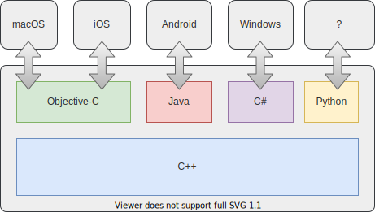

# HelloDjinni

[TOC]

## 1、介绍Djinni

Djinni目前有两个github版本

* [Dropbox版本](https://github.com/dropbox/djinni)
* [Snapchat版本](https://github.com/Snapchat/djinni)。该版本是继承自Dropbox版本，增加使用Bazel工具

由于对Bazel不了解，并简化一些依赖问题，本文采用原始版本来使用Djinni。

> 这里有个官方网站[^1]用于介绍Djinni，本文优先参考这个网站的内容。

在官方网站[^1]上，定义Djinni是一个简单IDL，如下

> The Djinni [**Interface Definition Language**](https://djinni.xlcpp.dev/djinni-generator/idl/) provides a simple, yet powerful way to design your interfaces.

可以理解为Djinni是一门IDL语言，使用配套工具生成平台(Android/iOS等)特性的接口，方便调用C++的实现。

官方文档[^1]描述，如下

> With Djinni you can implement interfaces in any target language and call the implementation from C++!

官方文档[^1]使用下面这个图，比较形象描述Djinni用于桥接C++到各个平台的语言。

## References

[^1]:https://djinni.xlcpp.dev/

